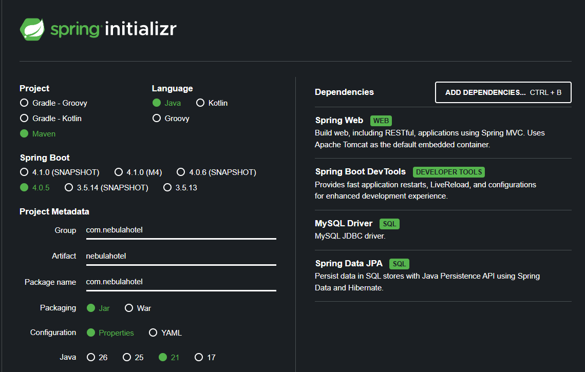

# Hotel Nebula API (JAVA/SQL)

## Criando uma API com Spring Boot, MySQL e Java

Este projeto apresenta a construção de uma API REST com Java, Spring Boot e MySQL, pensada para apoiar aulas práticas e acelerar o aprendizado em desenvolvimento backend. Ao longo do projeto, você verá como estruturar endpoints, organizar regras de negócio e explorar recursos essenciais do ecossistema Spring de forma objetiva e aplicável ao mercado.

**Visão Geral do Projeto**

Nesta primeira etapa, a API contempla os seguintes endpoints principais:

/hospedes
/quartos
/reservas
/hospedagens
/servicos
/avaliacoes

Além disso, serão implementadas rotas avançadas para consultas mais inteligentes e visão estratégica da operação:

/quartos/disponiveis
/reservas/ativas
/hospedes/historico/:id
/avaliacoes/resumo
/dashboard/faturamento

## Endpoints de hóspedes (implementados)

Nesta fase inicial, o recurso `hospedes` já está funcional com operações CRUD e busca por e-mail:

- `GET /hospedes` → lista todos os hóspedes.
- `GET /hospedes/{id}` → busca um hóspede por identificador.
- `GET /hospedes/email/{email}` → busca um hóspede por e-mail.
- `POST /hospedes` → cria um novo hóspede.
- `PUT /hospedes/{id}` → atualiza os dados de um hóspede.
- `DELETE /hospedes/{id}` → remove um hóspede.

Exemplo de payload para criação/atualização:

```json
{
   "idHospede": 10,
   "nome": "Fernanda Souza",
   "email": "fernanda.souza@email.com",
   "cpf": "111.222.333-44",
   "telefone": "+55 11 98888-7777",
   "dataNascimento": "1990-06-18",
   "dataCadastro": "2026-03-31T10:30:00",
   "ativo": true
}
```

## Endpoints implementados nesta etapa

Além de `hospedes`, os seguintes recursos já estão disponíveis:

- `GET /quartos`, `GET /quartos/{id}`, `POST /quartos`, `PUT /quartos/{id}`, `DELETE /quartos/{id}`
- `GET /quartos/disponiveis`
- `GET /reservas`, `GET /reservas/{id}`, `POST /reservas`, `PUT /reservas/{id}`, `DELETE /reservas/{id}`
- `GET /reservas/ativas`
- `GET /hospedagens`, `GET /hospedagens/{id}`, `POST /hospedagens`, `PUT /hospedagens/{id}`, `DELETE /hospedagens/{id}`
- `GET /servicos`, `GET /servicos/{id}`, `POST /servicos`, `PUT /servicos/{id}`, `DELETE /servicos/{id}`
- `GET /servicos/disponiveis`
- `GET /avaliacoes`, `GET /avaliacoes/{id}`, `POST /avaliacoes`, `PUT /avaliacoes/{id}`, `DELETE /avaliacoes/{id}`
- `GET /avaliacoes/resumo`
- `GET /hospedes/historico/{id}`
- `GET /dashboard/faturamento`

Com isso, todos os endpoints principais descritos no início do documento já têm implementação base no projeto.

## Spring e Spring Boot?

Spring é um framework de desenvolvimento de aplicações Java voltado para a construção de sistemas corporativos robustos e escaláveis. Ele fornece um conjunto abrangente de recursos e bibliotecas que facilitam o desenvolvimento, a configuração e a integração de aplicativos.

Spring Boot, por sua vez, é uma extensão do Spring Framework que simplifica ainda mais o processo de criação de aplicativos Java. Ele oferece convenções de configuração inteligentes e um conjunto de bibliotecas pré-configuradas para facilitar o desenvolvimento de aplicativos independentes e prontos para produção.

A relação entre Spring e Spring Boot é que o Spring Boot é construído em cima do Spring Framework, aproveitando muitos de seus recursos e aprimorando a produtividade do desenvolvedor. O Spring Boot simplifica a configuração e a inicialização de aplicativos Spring, fornecendo padrões de configuração inteligentes e um modelo de programação "convenção sobre configuração". Com o Spring Boot, os desenvolvedores podem criar aplicativos Java de forma mais rápida e eficiente, aproveitando os recursos poderosos do Spring Framework.

## Componentes e Fluxo

O projeto segue uma arquitetura baseada em repositórios, que é uma abordagem comum para organizar o código de forma a separar as preocupações e facilitar a manutenção. Abaixo estão os principais componentes e o fluxo de dados:


#### 1. Business Logic (Lógica de Negócio)

- Interage diretamente com o Repository.

- Envia e recebe Business Entities (entidades de domínio) para persistência e consultas.

#### 2. Repository

- Atua como fachada entre a lógica de negócio e o acesso à base de dados.

- Recebe queries de persistência e devolve entidades.

- Delegações internas:

**Data Mapper**: transforma as entidades do domínio para o formato do banco de dados e vice-versa.

**Query Object**: encapsula consultas complexas para buscar dados no Data Source.

#### 4. Data Mapper

Responsável por mapear os dados entre as entidades de negócio e os dados persistidos no Data Source.

#### 5. Query Object

Contém lógica de consulta específica, reutilizável e separada do repositório principal.

#### 6. Data Source (Fonte de Dados)

Representa o banco de dados ou qualquer outro mecanismo de armazenamento persistente.

### **Fluxo de Dados**

O fluxo de dados segue então dois conceitos:

1. A lógica de negócio não se preocupa com como os dados são armazenados ou recuperados.

2. O repositório orquestra os mapeamentos e consultas, mantendo a lógica de persistência isolada e reutilizável.

## **Passo 1: Criando o Projeto**

### **No [start.spring.io](https://start.spring.io/), selecione:**

- **Project:**Maven
- **Language:** Java
- **Dependencies:**
    - **Spring Web** (para API REST)
    - **Spring DevTools** (para facilitar o desenvolvimento)
    - **Spring Data JPA** (para o banco de dados)
    - **MySQL Driver** (para conectar com o MySQL)

👉 **Importe o projeto no IntelliJ IDEA** (ou sua IDE favorita).



**Estrutura do Projeto que iremos criar. Se quiserem, já podemos criar os arquivos que não existirem.** 

A estrutura abaixo segue o princípio da separação de responsabilidades, onde cada classe tem um papel específico. Os models representam as entidades e os dados da aplicação, os controllers lidam com as requisições e respostas HTTP, e os repositories tratam da persistência dos dados. Essa abordagem ajuda a manter o código organizado, modular e facilita a manutenção e a evolução da API ao longo do tempo.

```
📂 projeto/
├── 📂 src/main/Java/
│   ├── 📄 NebulaHotelApplication.java (Inicia a aplicação)
│   ├── 📂 model/
│   │   └── 📄 Hospedes.java (Define a estrutura dos dados)
│   ├── 📂 repository/
│   │   └── 📄 HospedesRepository.java (Conversa com o banco)
│   └── 📂 controller/
│       └── 📄 HospedesController.java (Recebe as requisições HTTP)
├── 📂 src/main/resources/
    └── 📄 application.properties (Configura o banco de dados)


1. **Models**:
   As classes chamadas de "models" representam as entidades de negócio do seu sistema. Essas classes modelam os dados e geralmente correspondem às tabelas em um banco de dados relacional. Os modelos encapsulam os atributos e comportamentos relacionados a uma entidade específica, como um usuário, produto, pedido etc. Eles são responsáveis por representar os dados e fornecer métodos para acessá-los e manipulá-los.

2. **Controllers**:
   As classes chamadas de "controllers" são responsáveis por receber as solicitações HTTP dos clientes e processá-las. Os controllers lidam com a lógica da aplicação, roteando as solicitações para os métodos apropriados e retornando as respostas apropriadas. Eles atuam como intermediários entre as requisições do cliente e as operações a serem realizadas nos modelos e nos serviços. Os controllers geralmente contêm métodos que são anotados com @RequestMapping ou outras anotações do Spring para mapear os endpoints da API e definir o comportamento esperado.

3. **Repositories**:
   As classes chamadas de "repositories" são responsáveis pela persistência dos dados. Elas são usadas para interagir com o banco de dados ou qualquer outro mecanismo de armazenamento de dados. Os repositories fornecem métodos para criar, recuperar, atualizar e excluir dados no banco de dados. Eles encapsulam a lógica de acesso aos dados e oferecem uma camada de abstração para as operações de leitura e gravação. Os repositories são tipicamente implementados usando frameworks ORM (Object-Relational Mapping), como o Spring Data JPA, que simplificam a interação com o banco de dados.

## **Passo 2: Configurando o Banco de Dados (MySQL)**

Antes de tudo, vamos alimentar o MySQL com o banco de dados `hotel_nebula` para que a aplicação consiga se conectar. Isso pode ser feito usando um cliente MySQL, como o MySQL Workbench. Os dados estão disponíveis no arquivo `hotel_nebula.sql` (na raiz do projeto) e podem ser importados diretamente para o MySQL. Certifique-se de que o banco de dados `hotel_nebula` esteja criado antes de importar os dados.

Agora vamos configurar a conexão do Spring Boot com o MySQL. Para isso, precisamos editar o arquivo `application.properties` que fica em `src/main/resources`. Este arquivo é onde definimos as configurações da nossa aplicação, incluindo as informações de conexão com o banco de dados.

**No arquivo `application.properties` (em `src/main/resources`):**

```properties
# Configuracoes do Spring Boot para a API do Hotel Nebula
## Porta em que a API sera executada.
## Algo como http://localhost:{porta}/
server.port = 8082

## Configuracao URL de conexao com o banco
## Importante que o MySQL esteja preparado com o banco antes de executar esse programa
spring.datasource.url=jdbc:mysql://localhost:3306/hotel_nebula

## Usuario de acesso
spring.datasource.username=root

## Senha do banco
spring.datasource.password=root

## Configuracao de atualizacoes do banco
spring.jpa.hibernate.ddl-auto=none

## Configuracao que mostra que o SQL que foi executado
spring.jpa.properties.hibernate.show_sql=true

## Configuracao que mostra o SQL que foi executado
spring.jpa.properties.hibernate.dialect=org.hibernate.dialect.MySQLDialect

**O que isso faz?**

- Define 

- **onde o Spring deve buscar os dados**: MySQL.
- **`hotel_nebula`** é o nome do banco de dados.
- **`usuario`**
- **`senha`**

Agora vamos criar os arquivos de model, repository e controller para o recurso `hospedes`, que é o primeiro recurso que vamos implementar. Oriente-se pelos arquivos de exemplo que já existem no projeto e siga a estrutura de pastas e nomenclatura para manter a organização do código.