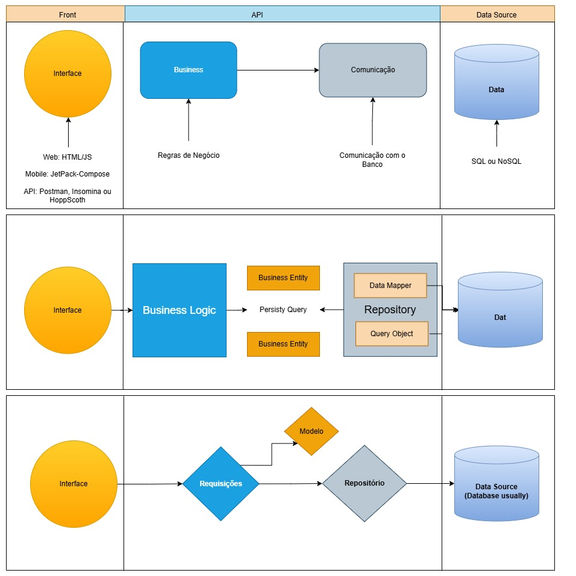
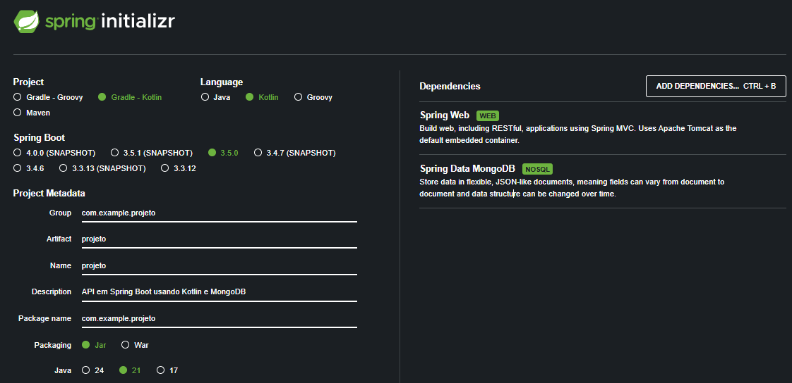

# Hotel Nebula API (Kotlin/NoSQL)

## Criando uma API com Spring Boot, Kotlin e MongoDB

Este projeto apresenta a construção de uma API REST com Kotlin, Spring Boot e MongoDB, pensada para apoiar aulas práticas e acelerar o aprendizado em desenvolvimento backend. Ao longo do projeto, você verá como estruturar endpoints, organizar regras de negócio e explorar recursos essenciais do ecossistema Spring de forma objetiva e aplicável ao mercado.

**Visão Geral do Projeto**

Nesta primeira etapa, a API contempla os seguintes endpoints principais:

/hospedes
/quartos
/reservas
/hospedagens
/servicos
/avaliacoes

Além disso, serão implementadas rotas avançadas para consultas mais inteligentes e visão estratégica da operação:

/quartos/disponiveis
/reservas/ativas
/hospedes/historico/:id
/avaliacoes/resumo
/dashboard/faturamento

## Endpoints de hóspedes (escopo do módulo)

O recurso `hospedes` segue o mesmo contrato da versão Java/SQL:

- `GET /hospedes` → lista todos os hóspedes.
- `GET /hospedes/{id}` → busca um hóspede por identificador.
- `GET /hospedes/email/{email}` → busca um hóspede por e-mail.
- `POST /hospedes` → cria um novo hóspede.
- `PUT /hospedes/{id}` → atualiza os dados de um hóspede.
- `DELETE /hospedes/{id}` → remove um hóspede.

Exemplo de payload para criação/atualização:

```json
{
   "idHospede": 10,
   "nome": "Fernanda Souza",
   "email": "fernanda.souza@email.com",
   "cpf": "111.222.333-44",
   "telefone": "+55 11 98888-7777",
   "dataNascimento": "1990-06-18",
   "dataCadastro": "2026-03-31T10:30:00",
   "ativo": true
}
```

## Endpoints previstos nesta etapa

Além de `hospedes`, o módulo Kotlin/NoSQL mantém o mesmo escopo funcional:

- `GET /quartos`, `GET /quartos/{id}`, `POST /quartos`, `PUT /quartos/{id}`, `DELETE /quartos/{id}`
- `GET /quartos/disponiveis`
- `GET /reservas`, `GET /reservas/{id}`, `POST /reservas`, `PUT /reservas/{id}`, `DELETE /reservas/{id}`
- `GET /reservas/ativas`
- `GET /hospedagens`, `GET /hospedagens/{id}`, `POST /hospedagens`, `PUT /hospedagens/{id}`, `DELETE /hospedagens/{id}`
- `GET /servicos`, `GET /servicos/{id}`, `POST /servicos`, `PUT /servicos/{id}`, `DELETE /servicos/{id}`
- `GET /servicos/disponiveis`
- `GET /avaliacoes`, `GET /avaliacoes/{id}`, `POST /avaliacoes`, `PUT /avaliacoes/{id}`, `DELETE /avaliacoes/{id}`
- `GET /avaliacoes/resumo`
- `GET /hospedes/historico/{id}`
- `GET /dashboard/faturamento`

## Guia rápido: construir e executar a API

### 1) Pré-requisitos

- Java `21` instalado e configurado no `PATH`
- MongoDB `6+` em execução
- Gradle Wrapper do projeto (já incluído: `gradlew.bat`)

### 2) Criar e popular o banco NoSQL

As coleções de exemplo estão em `../data/colecoes/*.json`.

Exemplo de importação (PowerShell):

```powershell
mongoimport --db hotel_nebula --collection hospedes --file "..\data\colecoes\hospedes.json" --jsonArray
mongoimport --db hotel_nebula --collection quartos --file "..\data\colecoes\quartos.json" --jsonArray
mongoimport --db hotel_nebula --collection reservas --file "..\data\colecoes\reservas.json" --jsonArray
mongoimport --db hotel_nebula --collection hospedagens --file "..\data\colecoes\hospedagens.json" --jsonArray
mongoimport --db hotel_nebula --collection servicos --file "..\data\colecoes\servicos.json" --jsonArray
mongoimport --db hotel_nebula --collection feedbacks --file "..\data\colecoes\feedbacks.json" --jsonArray
```

### 3) Configurar conexão

No arquivo `src/main/resources/application.properties`, configure:

```properties
spring.application.name=nebulahotel
server.port=8083
spring.data.mongodb.uri=mongodb://localhost:27017/hotel_nebula
```

### 4) Build e execução (Windows / PowerShell)

```powershell
Set-Location "c:\Users\gabriel.astazevedo\Documents\GitHub\hotel-nebula-api\api-kotlin-nosql"
.\gradlew.bat clean build -x test
.\gradlew.bat bootRun
```

API disponível em: `http://localhost:8083`

### 5) Teste rápido de endpoint

```powershell
Invoke-RestMethod -Uri "http://localhost:8083/hospedes" -Method Get
```

Se ocorrer erro de compilação com `release version 21 not supported`, atualize seu JDK local para a versão 21.

## Spring e Spring Boot?

Spring é um framework de desenvolvimento de aplicações Java e Kotlin voltado para a construção de sistemas corporativos robustos e escaláveis. Ele fornece um conjunto abrangente de recursos e bibliotecas que facilitam o desenvolvimento, a configuração e a integração de aplicativos.

Spring Boot, por sua vez, é uma extensão do Spring Framework que simplifica ainda mais o processo de criação de aplicações Kotlin. Ele oferece convenções de configuração inteligentes e um conjunto de bibliotecas pré-configuradas para facilitar o desenvolvimento de aplicativos independentes e prontos para produção.

A relação entre Spring e Spring Boot é que o Spring Boot é construído em cima do Spring Framework, aproveitando muitos de seus recursos e aprimorando a produtividade do desenvolvedor. Com o Spring Boot, os desenvolvedores podem criar aplicações de forma mais rápida e eficiente, aproveitando os recursos poderosos do Spring Framework.

## Componentes e Fluxo

O projeto segue uma arquitetura baseada em repositórios, que é uma abordagem comum para organizar o código de forma a separar as preocupações e facilitar a manutenção. Abaixo estão os principais componentes e o fluxo de dados:



#### 1. Business Logic (Lógica de Negócio)

- Interage diretamente com o Repository.
- Envia e recebe entidades de domínio para persistência e consultas.

#### 2. Repository

- Atua como fachada entre a lógica de negócio e o acesso à base de dados.
- Recebe operações de persistência e devolve entidades.

#### 3. Data Source (Fonte de Dados)

Representa o MongoDB (ou outro mecanismo de armazenamento persistente).

### **Fluxo de Dados**

O fluxo de dados segue então dois conceitos:

1. A lógica de negócio não se preocupa com como os dados são armazenados ou recuperados.
2. O repositório orquestra as consultas e persistência, mantendo a lógica de dados isolada e reutilizável.

## **Passo 1: Criando o Projeto**

### **No [start.spring.io](https://start.spring.io/), selecione:**

- **Project:** Gradle - Kotlin
- **Language:** Kotlin
- **Dependencies:**
    - **Spring Web** (para API REST)
    - **Spring Data MongoDB** (para o banco NoSQL)
    - **Jackson Module Kotlin** (serialização JSON com Kotlin)

👉 **Importe o projeto no IntelliJ IDEA** (ou sua IDE favorita).



## **Passo 2: Configurando o Banco de Dados (MongoDB)**

Antes de tudo, carregue os dados de exemplo em `../data/colecoes` no banco `hotel_nebula`.

Depois disso, ajuste o arquivo `application.properties` em `src/main/resources`:

```properties
spring.application.name=nebulahotel
server.port=8083
spring.data.mongodb.uri=mongodb://localhost:27017/hotel_nebula
```

**O que isso faz?**

- Define onde o Spring deve buscar os dados: MongoDB.
- Define `hotel_nebula` como banco da aplicação.
- Define a porta HTTP da API (`server.port`).

## **Passo 3: Estrutura inicial do projeto**

A estrutura abaixo segue o princípio da separação de responsabilidades e a mesma organização da versão Java, adaptada para Kotlin:

```text
📂 projeto/
├── 📂 src/main/kotlin/
│   ├── 📄 NebulahotelApplication.kt (Inicia a aplicação)
│   ├── 📂 model/
│   │   └── 📄 Hospedes.kt (Define a estrutura dos dados)
│   ├── 📂 repository/
│   │   └── 📄 HospedesRepository.kt (Conversa com o banco)
│   └── 📂 controller/
│       └── 📄 HospedesController.kt (Recebe requisições HTTP)
├── 📂 src/main/resources/
│   └── 📄 application.properties (Configura o banco)
└── 📄 build.gradle.kts (Build Gradle e dependências)
```